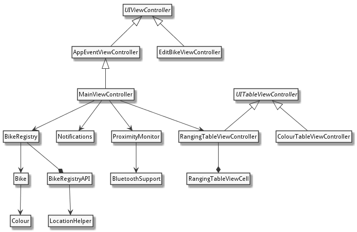
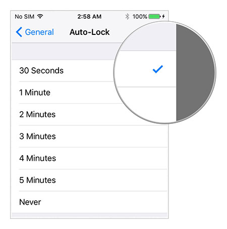

# Abstract

# Introduction

This software report accompanies the completed iOS app _FindMyBike_. It continues some of the discussion begun in the proposal already submitted.

The Xcode source code for _FindMyBike_ can be found in the zip file provided with this document.

## Specifications

The development environment used for the app adheres to the requirements of the assignment brief:

- Xcode 8
- Swift 3.1
- iOS 10.3 SDK
- Platforms: iPhone 6 and later (iOS simulator or physical device)

The following Apple frameworks were used in building the application:

- [CoreLocation](https://developer.apple.com/documentation/corelocation)
- [CoreBluetooth](https://developer.apple.com/documentation/corebluetooth)
- [UserNotifications](https://developer.apple.com/documentation/usernotifications)
- [UIKit](https://developer.apple.com/documentation/uikit)
- [Foundation](https://developer.apple.com/documentation/foundation)

No third-party libraries or other frameworks were used.

## User guide

A user guide for the app can be found on [the project website](https://jamesdonoh.github.io/FindMyBike/userguide/) and is included as a separate file `userguide.pdf` supplied along with this report.

## Usability evaluation

A key goal in the design of the application was simplicity and clarity. The Apple Human Interface Guidelines [-@hig] state that 'clarity' is one of the themes that differentiates iOS from other platforms, defining it in terms of legibility of text and 'a sharpened focus on functionality'.

### Clarity

One example of applying this theme in practice is the content and layout of the cells in the main table view. Rather than specifying a particular size and weight for the text in the `UILabel` components, predefined iOS text styles of 'Headline' and 'Subhead' were used. This enables the platform's Dynamic Type mechanism to respond to user preferences and accessibility settings [@textprogramming] and thereby ensure legibility.

The principle of clarity also applies to the choice of what level of detail is appropriate for each level of navigation. For example, the table view cells could have included the iBeacon settings for each bike (UUID, major and minor) but this would have created a more cluttered user interface without adding much value. Instead it was decided to only show these values when the user actually edits their bike details.

Conversley, some testers have reported that the text size used for labels and text fields on the _Edit Bike_ scene is too small. This screen uses an explicit font size of 14 points in order to allow the beacon UUID to be displayed in its entirety without truncating the text on a 4.7" screen such as the iPhone 6 or later while maintaining consistency with the other inputs. This was important during the early phases of app development where the UUID was entered manually, a difficult an error-prone process. Even so, on smaller screens (such as the 4" iPhone SE) the UUID is still truncated. As in the final app the UUID is no longer editable, the easiest solution to this problem would be to remove the application UUID from the Edit Bike screen completely.

### Discoverability

Another usability factor that was considered was discoverability, meaning the level to which a new user can determine what actions can be performed and how to perform them. The right chevron displayed alongside the 'My Bike' cell is used as a visual hint that the user can tap the cell in order to view more information. The chevron (known as a 'disclosure indicator' in iOS parlance) signals what Norman [@norman] terms an 'affordance', namely the ability to access a more detailed view. Note that while other ways of signalling this affordance are possible, by using the convention of the standard table view disclosure indicator, the user can apply the knowledge they have learned from using other iOS apps. This relates to the stated Apple design principle of 'consistency', specificaly that an app should implement "familiar standards and paradigms by using system-provided interface elements" [@hig].

#### Inputs

The 'Make' and 'Model' text inputs are currently free text fields. As there is a finite set of common motorcycle makes, it would be more convenient to allow the user to choose a make from a pre-populated list. The iOS equivalent of typical 'drop-down' selection boxes found on web pages are 'pickers', which present a scrollable list of values, usually at the bottom of the screen. This may be a suitable way of implementing the selection.

#### Photos and colours

Early in the development of the _Edit Bike_ scene a method for adding a custom photo to illustrate the user's bike was added through the 'Choose photo' button. This uses the system `UIImagePickerController` to allows the user to choose a photo from their Photo Library, which is then displayed in the `RangingTableViewController`. Although this is a useful feature for an individual user, it creates challenges if these photos need to be shared with other users. These include:

- **Storage** - a network-available location for uploading and downloading user photos needs to be created, with the necessary access from the API
- **Security** - access control must be enforced to prevent users from modifying each others' photos. In addition some form of automated virus/malware scanning should be implemented
- **Privacy** - the uploaded photos should only be accessible to registered users when the associated bike is detected
- **Content safety** - uploaded photos should be checked to ensure they do not contain adult content or other imagery that violates App Store policies.

The last requirement is emphasised in section 1.2 of the App Store Review Guidelines ("User Generated Content") [@appstore], which describes the requirement for filtering and also states that apps featuring user-generated content must include "mechanism to report offensive content and timely responses to concerns". In the light of these additional concerns, it was decided to only store photos locally on the device and not share them with other users. In place of photos, the ability for users to input their bike's colour was added, so that missing bikes can be easily identified without the risks associated with allowing photos.

### Evaluation of usability issues

#### Keyboards

When inputting the beacon minor on the 'Edit Bike' screen, a standard QWERTY keyboard is displayed. iOS supports displaying specialised keyboards for different types of text field using the `UIKeyboardType` enumeration. Using a numeric keyboard may help the user by preventing them inputting non-numeric characters, however the supplied numeric keyboards do not offer a built-in 'Done' key to allow the user to submit their input, as shown in Figure \ref{numberpad}. Some options would be to implement this separately using a `UIToolbar` placed above the number pad, or a custom input view for numeric input as used by the Numbers app [@keyboards].

{ width=40% }

#### Beacon identifiers

In the Core Location framework, iBeacons are grouped into regions identified by a _proximity UUID_ - a 128-bit value that is intended to identify a certain beacon type or organisation [@regionmonitoring], optionally combined with a _major_ and _minor_ value (16-bit unsigned integers). The framework makes a distinction between 'monitoring' for a beacon regions (which may include many beacons) and 'ranging' for individual beacons within a region once entered, further recommending that 'ranging' is only performed when the app is in the foreground [@ibeacon] for reasons of accuracy.

One usability problem with the current app design arises from Apple's decision to restrict the Core Location framework to monitor 20 regions at one time. According to Apple this is because regions are a limited "shared system resource" [@regionmonitoring], although this contrasts with the Android platform which has no OS-imposed limit on the number of beacon identifiers to be monitored. The 20-region limit restriction is described by one becacon retailer as "a great example of unnecessary complexity invented by great minds" [@beaconzoneuuid].

In a conventional geofencing-type application where the regions are defined based on geographical coordinates, the 20-region limitation can be mitigated by regularly altering the list of monitored regions to include only those already-known locations closest to the user's current location [@drobnik], however in a beacon-based application like _FindMyBike_ the geographical location of each beacon is not known in advance, making this impossible.

Because of the relative complexity of configuring an iBeacon's identifier, for the greatest user convenience _FindMyBike_ would be able to monitor for any identifier, so that the default values set by beacon manufacturers could be used without the need for reconfiguration. However, Core Location's restriction on the number of regions that can be monitored at once would limit the number of individual missing bikes that could be detected to 20.

Consequently, the current implementation of the app defines a single proximity UUID and major pair that is monitored by the application in the background, defined by the `Constants` struct as follows:

    static let applicationUUID = UUID(uuidString: "21EECF71-D5C7-4A00-9B90-27C94B5146EA")!
    static let applicationMajor = UInt16(1)

The following outlines the approach used:

- The user's iPhone detects that it has entered the application-defined `CLBeaconRegion` (defined by the identifiers above and the label `io.github.jamesdonoh.FindMyBike`)
- iOS sends the `didEnterRegion` notification to the app's instance of `CLLocationManagerDelegate`, which is provided by `ProximityMonitor`
- `ProximityMonitor` begins ranging for all beacons within the region
- When individual beacons are ranged, `ProximityMonitor` passes the minor value of each beacon to `BikeRegistry` to determine if any of them represent missing bikes
- If any minors match, a notification is sent to the user

Note that this implementation disregards Apple's advice to only perform ranging when the app is in the foreground, but given the limited number of regions that can be monitored at one time it is the only practical way to achieve the desired functionality for more than 20 missing bikes.

## Application design

Figure \ref{classes} shows an overview of the main classes in _FindMyBike_ and their relationships. Classes provided by the underlying UIKit framework are shown in _italics_.

#### View Controllers

The app implements the following custom subclasses of `UIViewController`:

- `AppEventViewController`
- `MainViewController`
- `EditBikeViewController`
- `ColourTableViewController`
- `RangingTableViewController`

Certain design features of these controllers are discussed below.

### `AppEventViewController`

This `UIViewController` subclass is not instantiated directly. Instead it provides a generic base class for view controllers that wish to receive notifications about app lifecycle events that are normally only received by the `AppDelegate` object such as `applicationDidBecomeActive`. It registers to receive these events from a `NotificationCenter` instance, a form of the observer pattern [@gangoffour]. This allows subclasses to provide controller-specific behaviour in response to them without requiring any direct coupling between them and the `AppDelegate` instance. As an example of this, `MainViewController` uses the capability to activate and deactivate its `ProximityMonitor` instance as the application moves between foreground and background states.

### `MainViewController`

This controller acts as the primary view controller for the application, acting as the central point of coordination where state is stored (through a reference to an instance of `BikeRegistry`) and notifications from application services (such as `ProximityMonitor`) are handled. The storyboard scene for the `MainViewController` contains a vertical stack view that contains a `RangingTableViewController` within a Container View. The original thinking behind this approach was to allow the `MainViewController` to "combine the content from multiple view controllers into a single user interface" [@containerview]. In this approach there is a parent-child relationship between each controller and the containing controller.

During development it became apparent that most of the app's interface could be provided via a single controller, `RangingViewController`. However, even with a single child controller, there are advantages to maintaining this separation, as the `UITableViewController` implementation methods (e.g. `numberOfSections`) are kept separate from other concerns such as data management and proximity detection. Therefore the arrangement was retained to illustrate this approach.

### `ColourTableViewController``

This is a simple sublclass of `UITableViewController` that displays a list of colours from a predefined list and allow users to select one. This provides a view controller, a data source and a delegate in a single class [@bignerd]. The controller is presented modally from the _Edit Bike_ scene by the user tapping on a text label.

The original UIKit-provided solution for allowing the user to select items from a list (iOS 2.0 and later) is `UIPickerView`, which "uses a spinning-wheel or slot-machine metaphor to show one or more sets of values." [@uipickerview]. However it seems that the 'house style' of many Apple apps is increasingly to use a `UITableView` in place of a `UIPickerView` where only a single value is being selected (see for example, the 'Repeat' option in the _New Event_ scene in the Calendar app, or the 'Auto-Lock' option under Display & Brigtness in the Settings app, Figure \ref{autolock}).

{ width=40% }

The current controller contains logic for handling item selection (using a 'checkmark' cell accessory) and passing data back to where it was presented from. As an improvement to this approach, controller could be refactored into a general-purpose 'single item picker' controller which could be used as a drop-in replacement for `UIPickerView` with only the data source needing to be customised. This would make it easy to create consistent selection interfaces and promote code reuse, following the object-oriented design goal of finding a design that is "specific to the problem at hand but also general enough to address future problems and requirements" [@gangoffour].

## Development issues

### Delegation

The classes provided by the Cocoa frameworks make extensive use of the _delegation_ pattern "in which one object in a program acts on behalf of, or in coordination with, another object" [@delegation]. This is in contrast to a model where behaviour is inherited (and may be overridden) from class to subclass. Inheritance in object-oriented programming creates a tight coupling between a parent class and its subclass and breaks encapsulation, whereas composition enforces a 'black box' approach based on well-defined interfaces, and is therefore usually preferred [@gangoffour].

Although delegation allows complex behaviours to be composed dynamically at run time, one price (as Gamma et. al highlight, p.21) is that it make code harder to understand. This is evidenced in the app in the relationship between `MainViewController`, `RangingTableViewController` and `EditBikeController`. Since these classes only maintain a weak reference to an instance of the user's bike, for it to be persisted it must be passed "up" through two levels of composition to the `BikeRegistry` class, via the `BikeChangedDelegate` protocol. If the app evolved to include a large number of additional controllers this approach could become excessively complex.

### Data updates

Currently _FindMyBike_ requests data about missing bikes from the server only when it starts. As well as meaning that if the user is not online when they first run the app no data will be downloaded, the problem is that if a new bike is reported missing after the app has been started, other users will not detect it as missing till they restart their app. A better solution would be to download data updates periodically while the app is running, either using a `Timer` instance or scheduled background data refresh through the `performFetchWithCompletionHandler` method.

### Prototypes

The proposal described that the app development process would use the concept of a 'production prototype' [@wysocki] both to learn the characteristics of the iOS environment and to test out specific areas of functionality. In fact multiple prototypes were developed:

#### BeaconRanger

The first production prototype app developed was called _BeaconRanger_ and was completed around week 5 of the development timeline given in the proposal. It had no bike-related functionality or network capabilities but was focused on ranging iBeacons when the app was in the foreground. Parts of its purpose was to iron out the relatively complex state transitions that occur while location access permission, and to safely handle the user later rescinding that permission and re-granting it. The advantage of this approach was that it helped to be able to test and debug this discrete aspect of functionality behaviour in isolation.

Much of the code that was developed for _BeaconRanger_ was reused as the `ProxmityManager` and `BluetoothSupport` classes in _FindMyBike_.

#### AboutMyBike

The first version of the app that was built was called `AboutMyBike`. It did not include any iBeacon capabilities but focused on the 

#### App Store description

[INSERT]
+ privacy?

## Marketing

### Network effects

There are two, slightly different features offered by _FindMyBike_:

- it allows a user to detect their proximity to their own bike, and therefore may allow them to locate it (for example, if they have forgotten where they parked it).
- it allows users to know if their missing bike has been detected by other users of the app, and therefore possibly recover it in the event of theft

The first feature above does not depend on any other app users. However, the effectiveness of the second feature is dependent on the number of users with the app installed that frequent the area of the missing bike. This feature is likely to be more useful in densely-populated areas (if a missing bike is in a desert, it is unlikely that many app users will enter its beacon region). But even if a large city, the usefulness of this feature is in proportion to the number of active app users. Each new user that installs the app in a densely-populated area increases the value of the app for other users, a phenomenon known as a 'positive network externality'[@shapiro], or network effect, which was first observed in communication technologies.

Aquiring enough users for this network effect to apply can be seen as a 'chicken-and-egg' problem. One way of resolving it is to ensure that the 'single-user' benefits are compelling enough if there are no other users of the network [@choudary]. By marketing the app's 'single-user' benefits first, it is hoped that enough users will start to use it that the second use becomes viable and eventually becomes more compelling than the 'single-user' mode.

With this in mind, a plan for developing the app further should include building additional features that support the 'single-user' mode, for example:

- Allowing the user to store other useful details about their bike, such as engine number or vehicle identification number (VIN), which may be useful in the event of reporting a theft to the police
- Store details of the user's breakdown recovery service contact number and membership number (AA, RAC, etc.)
- Allow the user to record important dates relating to their bike, such as MOT date or insurance expiry date, which could trigger a local notification when the date approaches.

### Promotion

Along with conventional types of promotion (such as purchasing advertising such as Google AdWords, or obtaining a paid-for promotional App Store placement, word-of-mouth is likely to be the most effective way of increasing the user base for _FindMyBike_. One way that apps achieve this is through authentic success stories. Tinder used this strategy effectively by staging stunts on college campuses where students claimed to have 'matched' with their professors [CITE] in order to drive downloads. An equivalent for _FindMyBike_ might be to create an artificial scenario where someone locates a missing bike using the app, and then use social media to promote the story.

Although the app itself is free, there is a (small) cost associated with buying an iBeacon (and replacing its battery from time to time). In order to remove barriers to adoption, another approach would be to give away a number of free preconfigured iBeacons. Assuming 1,000 beacons could be bought, configured and distributed to users in central London at a total cost of £10,000, this investment should be sufficient to produce a viable initial user base for network effects to begin to apply. This giveaway could be funded either via direct investment or in partnership with a motorcyling brand, shop or publication.

One targeted way to increase uptake would be to encourage owners of venues which receive a large number of riders as customers (such as biker cafes, garages and petrol stations) to have _FindMyBike_ installed on an iPhone at the venue. This would mean that if a stolen bike is taken to the garage/cafe in question it could be easily detected and the owner notified. Although undoubtedly an effective way of increasing bike recovery rates, the challenge lies in ensuring that the venue staff regularly see notifications delivered to their iPhone and are sufficiently incentivised to report the sightings.

# Conclusion and further work

## Privacy and ethical implications

Although in its current form _FindMyBike_ does not collect any information that identifies an individual, some users may be reluctant to use an app that requires 'always' access to Location Services on the basis that it appears to constantly track their position, which has privacy implications. Apple's decision to implement iBeacon support as part of Location Services means that the developer of such an app needs to educate users that although it constantly monitors beacon events, it only requests and transmits the user's absolute geographical location when strictly required (to report a missing bike's location). 

## Wearable implementation

One way of improving the usefulness of the app would be to implement watchOS support. Given the intended users of the app are motorcycle and scooter riders, who may not notice when their phone receives a notitication, a wearable extension of the app would increase the chance of them being aware of the notification and therefore reporting missing bikes. The simplest way to achieve this would be use the Watch Connectivity Framework to send missing bike detection notifications from the iPhone to the watch.

# References
